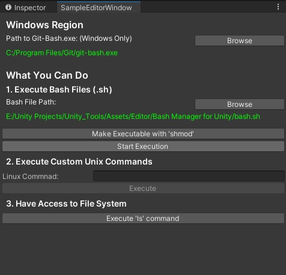

# .Net Bash Wrapper

### Summary

<p>.Net Bash Wrapper is a set of C# methods that helps you execute bash-shell commands or .sh files alongside Unity Engine and Unity Editor. The Wrapper can be also used on any .NET application.</p>

--- 

### Methods

#### 1. Run 
<b>Description:</b> </br>
Executes a shell-bash command or `.sh` script from a spesific directory.</br>
<b>Parameters:</b> </br>
- `string command`: The command to execute.
- `string directory`: The directory in which the .sh file can be found.
- `string osFile`: Operating system file. Unix default is "/bin/bash".

```c#
public static bool Run(string command, string directory, string osFile = "/bin/bash")
```
```c#
public static bool Run(string command, string osFile = "/bin/bash")
```
#### 2. Shmod 

<b>Description:</b> </br>
Makes a bash (.sh) script executable.</br>
<b>Parameters:</b> </br>
- `string bashFileName`: The name of file we want to make executable.
- `string directory`: The directory in which the .sh file can be found.
- `string osFile`: Operating system file. Unix default is "/bin/bash".

```c#
public static bool Shmod(string bashFileName, string directory, string osFile = "/bin/bash")
```

#### 2. ListFiles 

<b>Description:</b> </br>
Return the list of file names from a spesific directory.</br>
<b>Parameters:</b> </br>
- `string directoryPath`: The directory path.

```c#
public static List<string> ListFiles(string directoryPath)
```

### Preview


